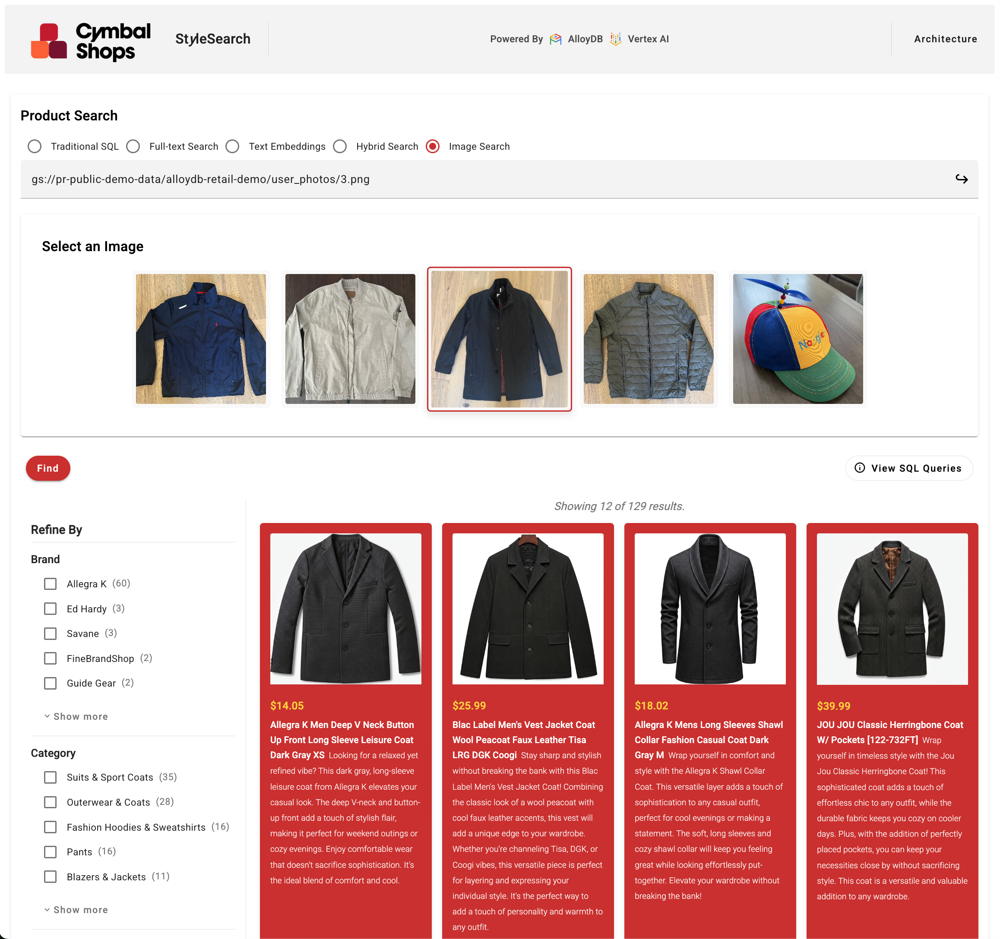

# Cymbal Shops StyleSearch AlloyDB AI Demo

This project demonstrates the AI capabilities of Google Cloud AlloyDB for PostgreSQL, particularly focusing on hybrid search (SQL + vector + full-text search) using a sample e-commerce dataset (Cymbal Shops).

Watch the demo video [here](https://youtu.be/WYfHrwYaWjw?si=UgfUOUyRTOem6Fht).

[](https://youtu.be/WYfHrwYaWjw?si=UgfUOUyRTOem6Fht)

## Overview

This project provides resources to set up and explore AlloyDB AI and other Google Cloud features. The infrastructure is deployed using Terraform, incorporating security best practices such as storing secrets in Secret Manager and disabling public IPs after setup.

* **Vector Embeddings**: Generating and storing embeddings for product data within AlloyDB.
* **ScaNN Index**: Utilizing Google's ScaNN index in AlloyDB for efficient vector similarity search.
* **Hybrid Search**: Combining traditional full-text search with vector search for hybrid results.
* **Imagen3 Image Generation**: Generating images for products in AlloyDB using Imagen3.
* **Gemini Product Descriptions**: Generating compelling product descriptions using Gemini.
* **AlloyDB Mulitmodal AI**: Showcasing how to leverage AlloyDB's integrated multimodal AI features.
* **Cloud Run Deployment**: Sample application UI deployed to Google Cloud Run.

## Project Structure

Key files and descriptions are provided below.

```
cymbal-shops-alloydb/
│
├── cymbal_shops_hybrid_search_alloydb_data_prep.ipynb  # Full data prep notebook (embeddings, FTS, etc.)
│
├── demo_app/                                           # Demo Application
│   ├── api/                                            # Node.js/Express backend API
│   ├── ui/                                             # Angular frontend UI
│   ├── deployment/                                     # Deployment scripts (Cloud Run)
│   ├── install.sh                                      # Installation script helper
│   ├── env.sh                                          # Environment setup helper
│   └── README.md                                       # README for the demo application
│
├── terraform/                                          # Terraform Infrastructure-as-Code
│   └── main.tf                                         # Defines the Google Cloud infrastructure:
│                                                       # - VPC Network and Firewall rules
│                                                       # - AlloyDB Cluster and Instance
│                                                       # - Secret Manager for database password
│                                                       # - Cloud Run service for the demo application
│                                                       # - Service accounts and IAM permissions
│
└── README.md                                           # This file
```

## Getting Started

### Prerequisites

* Google Cloud Project with billing enabled.
* [Google Cloud SDK (gcloud)](https://cloud.google.com/sdk/docs/install) installed and configured.
* Permissions to enable necessary Google Cloud APIs (e.g., Vertex AI, Cloud Run, Artifact Registry).
* Access to a Google Cloud environment where you can deploy resources and run Jupyter notebooks (e.g., Vertex AI Workbench).

### Option 1: Quick Deploy via Terraform

1. Create a new Google Cloud project.

1. Clone this repository:

    ``` bash
    git clone https://github.com/paulramsey/stylesearch-alloydb-ai-demo.git
    cd stylesearch-alloydb-ai-demo
    ```

1. Install pre-requisite libraries:

    1. Install [Terraform](https://developer.hashicorp.com/terraform/tutorials/aws-get-started/install-cli).

    1. Install the [Google Cloud SDK](https://cloud.google.com/sdk/docs/install).

    1. Install [psql](https://askubuntu.com/questions/1040765/how-to-install-psql-without-postgres).

1. Obtain authentication credentials:

    ``` bash
    gcloud auth login
    gcloud auth application-default login
    ```

    Read more about [Google Cloud Platform Authentication](https://cloud.google.com/docs/authentication).

1. Define environment variables for Terraform:
    > IMPORTANT: Replace the values for `YOUR_PROJECT`, `YOUR_REGION`, and `YOUR_ALLOYDB_ PASSWORD` in the commands below before running them.

    > IMPORTANT: Set `TF_VAR_argolis` to `true` if deploying to an Argolis environment. This will handle necessary org policies for you.

    > IMPORTANT: The password you choose for AlloyDB must conform to the following minimum complexity requirements: 
        "password.min_uppercase_letters"             = "1"
        "password.min_numerical_chars"               = "1"
        "password.min_pass_length"                   = "10"

    ``` bash
    export TF_VAR_gcp_project_id="YOUR_PROJECT"
    export TF_VAR_region="YOUR_REGION"
    export TF_VAR_alloydb_password="YOUR_ALLOYDB_PASSWORD"
    export TF_VAR_argolis="false"
    ```

    > **Note on Password Handling:** The `alloydb_password` is used by Terraform to set up the database, including creating extensions and importing data. The password is also stored in Google Secret Manager, and the deployed Cloud Run application retrieves it from there at runtime. This ensures the password is not exposed in the application's configuration.

1. Deploy base infrastructure with Terraform:

    1. Initialize terraform:

        ``` bash
        cd terraform/
        terraform init
        ```

    1. View resource creation plan:

        ``` bash
        terraform plan
        ```

    1. Apply the plan to deploy resources:

        ``` bash
        terraform apply
        ```

        > NOTE: If you get an error like the following, please run `terraform apply` again. `Error creating Secret: googleapi: Error 403: Secret Manager API has not been used in project before or it is disabled.`

1. The Terraform output (`demo_app_url`) will include a link to the deployed Cloud Run service that hosts the demo UI. Navigate to this url in your browser.

1. Watch the [demo video](https://youtu.be/WYfHrwYaWjw?si=UgfUOUyRTOem6Fht) to learn how to walk through the demo.

### Option 2: Full Data Prep Walkthrough

The magic of this demo is all in the data tier. A notebook has been provided showing step-by-step how the data for the demo was processed. You can use this notebook to better understand the underlying data techniques, and/or you can create a different data set using the same techniques to fit your own needs. 

1. Use the `cymbal_shops_hybrid_search_alloydb_data_prep.ipynb` notebook to:
    * Setup AlloyDB.
    * Import and process the product data.
    * Generate text embeddings using Vertex AI.
    * Generate sample product images using Imagen3.
    * Populate the database and configuring full-text search.
    * Setup vector search indexes and run sample queries.

2. To setup the demo UI:
    * Navigate to the `demo_app/` directory.
    * Follow the instructions in `demo_app/README.md` to deploy the backend API and frontend UI to Cloud Run.

## Security Considerations

### AlloyDB Public IP

For ease of setup, the Terraform configuration temporarily enables a public IP address on the AlloyDB instance. This allows the setup scripts to connect to the database and perform the initial data loading and configuration. Once the setup is complete, a final step in the Terraform process automatically disables the public IP to ensure the database is not exposed to the public internet.

## Clean-up

When you are done with lab, tear down the deployed infrastructure to avoid incurring ongoing charges for provisioned resources.

Options:

1. If you created a new, dedicated Google Cloud project to run this lab as recommended in the setup instructions, you can delete the whole project to remove all created resources.

    > IMPORTANT: Be sure to set PROJECT_ID to the correct project, and run this command ONLY if you are sure there is nothing in the project that you might still need. This command will permanently destroy everything in the project.

    ``` bash
    # Set your project id
    PROJECT_ID='YOUR PROJECT ID HERE'
    gcloud projects delete ${PROJECT_ID}
    ```

1. If you deployed resources into a shared project using Terraform, you can use Terraform to tear down the core infrastructure resources created during setup.

    > NOTE: If using this option, you will need to manually delete the resources created when executing the notebooks to avoid incurring charges for those services.

    ``` bash
    terraform destroy 
    ```

## Contributing

Contributions are welcome!

## License

Please refer to the LICENSE file for details.

## Disclaimer

This is **NOT** an officially supported Google product.

This software is provided "as is", without warranty of any kind, expressed or implied, including but not limited to, the warranties of merchantability, fitness for a particular purpose, and/or infringement.

See LICENSE file for additional details.