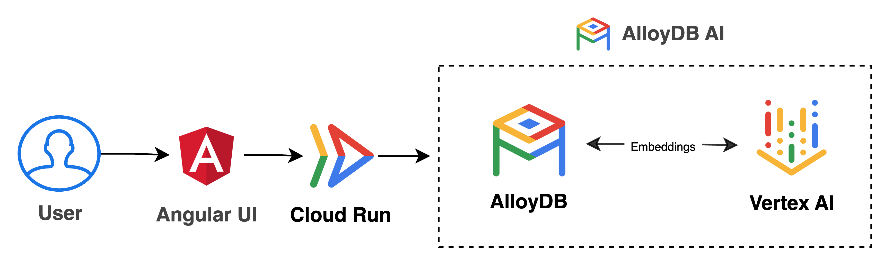

# Cymbal Shops Demo Application (API & UI)

This directory contains the source code for the Cymbal Shops demo application, which includes:

1.  **Backend API**: A Node.js/Express application (`api/`) that provides REST endpoints (`/api/*`) to interact with the AlloyDB database.
2.  **Frontend UI**: An Angular application (`ui/`) providing the user interface for searching products.
3.  **Deployment Scripts**: Helper scripts (`env.sh`, `install.sh`, `deployment/`) to deploy the application to Google Cloud Run or run locally.

**Note:** This application requires the AlloyDB database to be set up first using one of the notebooks in the parent directory (`../cymbal_shops_stylesearch_demo_shortcut.ipynb` or `../cymbal_shops_hybrid_search_alloydb_data_prep.ipynb`). If you are using Public IP to connect to AlloyDB, ensure your source public IP is allowed as an [Authorized Network](https://cloud.google.com/alloydb/docs/connect-public-ip) in AlloyDB.

## Architecture



* **Frontend**: Angular 17+ user interface (`ui/`).
* **Backend**: Node.js 20+ using Express (`api/`).
    * Serves the static Angular UI files.
    * Provides `/api/*` endpoints that connect to the AlloyDB instance.
* **Deployment**: The API and UI are packaged into a single Docker container and deployed to Cloud Run. The Express backend serves both the API routes and the static Angular frontend files.

## Prerequisites

* Node.js (v20 or later recommended)
* Angular CLI (v17 or later recommended)
* Access to the configured AlloyDB instance (ensure network connectivity and credentials).
* Google Cloud SDK (`gcloud`) installed and authenticated (`gcloud auth login`, `gcloud auth application-default login`).
* Docker installed and running (for building the container image).
* Git installed (for cloning the repository and tagging releases).
* A Google Cloud Project with Billing Enabled.
* Required APIs enabled in your Google Cloud project (e.g., Cloud Run, Artifact Registry, AlloyDB).
* The repository cloned to your local machine or Cloud Shell.

## Deployment to Cloud Run

These steps build the combined API/UI container image, push it to Artifact Registry, and deploy it as a Cloud Run service. This works best from Google Cloud Shell.

1.  **Clone Repo and Navigate to demo_app Directory:**
    ```bash
    git clone https://github.com/paulramsey/stylesearch-alloydb-ai-demo.git
    cd cymbal-shops-alloydb/demo_app
    ```

2.  **Authenticate to Google Cloud:**
    If you haven't already:
    ```bash
    gcloud auth login
    gcloud auth application-default login
    gcloud config set project YOUR_PROJECT_ID
    ```

3. **Configure Environment Variables:**
    * Edit the `env.sh` script:
        * Update the variables like `REGION`, `ALLOYDB_CLUSTER`, `ALLOYDB_INSTANCE`, and `VPC_NETWORK` to match your Google Cloud setup. 
        * If connecting over Public IP from your device, change `.ipAddress` to `.publicIpAddress` in the line starting with `export ALLOYDB_IP`.
    * Source the script. It will prompt for your AlloyDB `postgres` user password if the `ALLOYDB_PASSWORD` variable isn't already set.
        ```bash
        source ./env.sh
        # Enter password when prompted
        ```

4.  **Run the Deployment Script:**
    The `install.sh` script orchestrates the deployment process:
    * `deployment/deploy-registry.sh`: Creates an Artifact Registry repository named `cymbalshops` if it doesn't exist.
    * `deployment/deploy-frontend.sh`: Builds the Docker image, tags it based on the latest git tag, pushes it to Artifact Registry, and deploys the image to a Cloud Run service named `cymbalshops`. It configures the service with network settings and injects AlloyDB connection details as environment variables.
        ```bash
        source ./install.sh
        ```

5.  **Access the Application:**
    After deployment, `gcloud` will output the URL for the deployed Cloud Run service. You can access the Cymbal Shops application using this URL.

## Local Development Setup

To run the API and UI locally for development:

1.  **Authenticate to Google Cloud:**
    If you haven't already:
    ```bash
    gcloud auth login
    gcloud auth application-default login
    gcloud config set project YOUR_PROJECT_ID
    ```

2.  **Configure Environment Variables:**
    * Edit the `env.sh` script. 
        * Update the variables like `REGION`, `ALLOYDB_CLUSTER`, `ALLOYDB_INSTANCE`, and `VPC_NETWORK` to match your Google Cloud setup. 
        * If connecting over Public IP from your device, change `.ipAddress` to `.publicIpAddress` in the line starting with `export ALLOYDB_IP`.
    * Source the script. It will prompt for your AlloyDB `postgres` user password if the `ALLOYDB_PASSWORD` variable isn't already set.
        ```bash
        source ./env.sh
        # Enter password when prompted
        ```

2.  **Start the Backend API:**
    
    * Start the API:
        ```bash
        cd api/
        npm install
        npm start
        ```

3.  **Start the Frontend UI:**
    * Open another terminal.
    * In `ui/src/app/app.config.ts`, change `BASE_URL` from `/api` to `http://localhost:8080/api` (or use a specific IP instead of localhost if necessary, e.g. on GCE).
        ```bash
        cd ui/
        npm install
        npm start # or "ng serve --host 0.0.0.0" if running on GCE
        ```

    * The UI will now be available at `http://localhost:4200/`. It connects to the API server over port 8080 on localhost (or your defined api).